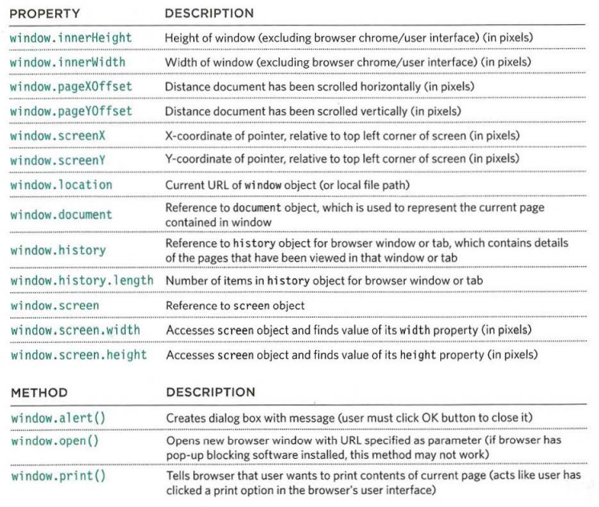
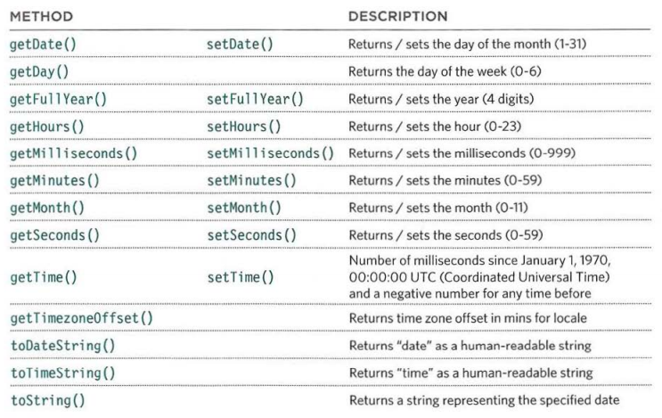

# Read: 07 - HTML Tables; JS Constructor Functions

### Tables : arrange data into rows and columns, `<table>` tag defines an HTML table , each table row is defined with a `<tr>` tag. Each table header is defined with a `<th>` tag. Each table data/cell is defined with a `<td>` tag.
* colspan : attribute to make a cell span many columns.
* rowspan : attribute to make a cell span many rows.
* `<thead>` tag : is used to group header content in a table.
* `<tbody>` tag : is used to group the body content in a table.
* `<tfoot>` tag : is used to group footer content in a table.
* cellpadding Attribute : is used to specify the space between the cell content and cell wall.
* cellspacing Attribute : is used to specify the space between the cells.
* border attribute : using on both the `<table>`and `<td>` elements to indicate the width of  the border in pixels.
* bgcolor attribute was used  to indicate background colors  of either the entire table or  individual table cells.

#### Ex :
```HTML
<!-- Ex 1 -->
<table width="px" cellpadding="px" cellspacing="px" border="px" bgcolor="#.....">
  <tr>
    <th bgcolor="#....."> . . . </th>
    <th> . . . </th>
  </tr>
  <tr>
    <td rowspan="#"> . . . </td>
    <td colspan="#"> . . . </td>
    <td> . . . </td>
  </tr>
</table>


<!-- Ex 2 -->
<table width="px" cellpadding="px" cellspacing="px" border="px" bgcolor="#.....">
 <thead>
 	<tr>
 		<th> . . . </th>
 	</tr>
 </thead>
 <tbody bgcolor="#.....">
 	<tr>
 		<th> . . . </th>
 	</tr>
 	<tr>
 		<th> . . . </th>
 	</tr>
 </tbody>
 <tfoot>
 	<tr>
 		<td> . . . </td>
 	</tr>
 </tfoot>
</table>
```

# JAVASCRIPT :

### Create new object from another object : `var newObject = new Object();`.
* add new Properties : `object.name = ' . . . ';`.
* add new method : `object.methodName = function(){ . . . . };`.

#### There is two way to create object (LITERAL NOTATION ,OBJECT CONSTRUCTOR NOTATION ), this keyword that is refer to the objects that inside it , we can store data in variables, we consider the array is object,

#### Three groups of objects model (browser of object model, document of object model ,global java script objects) , the first group is working with the windo second one is working with elements the third one is working with data type.

### WINDOW OBJECT :



### DATE & TIME OBJECT :


