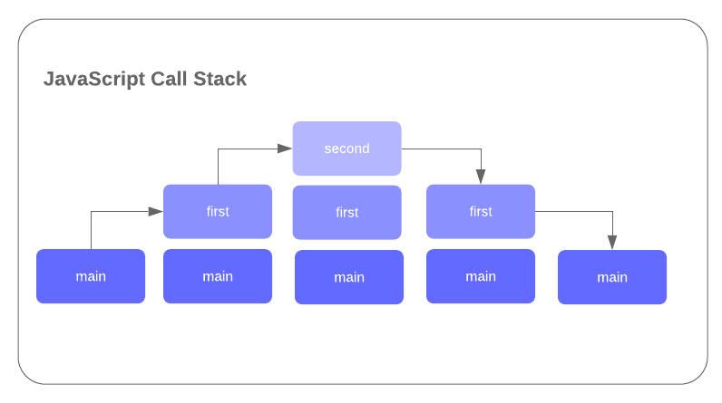

# Read: Class 10 - In memory storage

### What is a ‘call’?

* is a data structure that uses the Last In, First Out (LIFO) principle to temporarily store and manage function invocation (call).

### How many ‘calls’ can happen at once?

* only once

### What does LIFO mean?

* it means that the last function that gets pushed into the stack is the first to be pop out, when the function returns.

### Draw an example of a call stack and the functions that would need to be invoked to generate that call stack?

### What causes a Stack Overflow?

* The most-common cause of stack overflow is excessively deep or infinite recursion, in which a function calls itself so many times that the space needed to store the variables and information associated with each call is more than can fit on the stack

### What is a ‘refrence error’?

* This is as simple as when you try to use a variable that is not yet declared you get this type os errors.

### What is a ‘syntax error’?

* I know it’s in the name of the errors, but like it says itself, this occurs when you have something that cannot be parsed in terms of syntax, like when you try to parse an invalid object using JSON.parse.

### What is a ‘range error’?

* Try to manipulate an object with some kind of length and give it an invalid length and this kind of errors will show up.

### What is a ‘tyep error’?

* this types of errors show up when the types (number, string and so on) you are trying to use or access are incompatible, like accessing a property in an undefined type of variable.

### What is a breakpoint?

* a breakpoint is an intentional stopping or pausing place in a program

### What does the word ‘debugger’ do in your code?

* Debugging is the process of detecting and removing of existing and potential errors (also called as ‘bugs’) in a software code that can cause it to behave unexpectedly or crash. we can achieve from it the breakpoint

[Back To README!](https://yousefabujalboush.github.io/reading-notes/)
